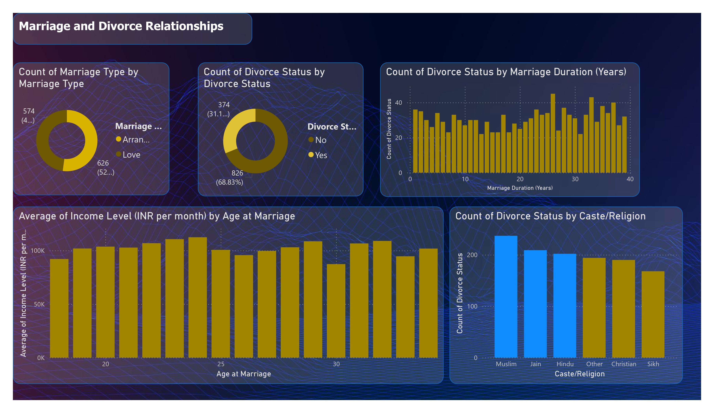

# Marriage-Divorce-Data-Analysis
This project explores factors influencing divorce by analyzing marriage duration, age at marriage, marriage type, and income level. Using data visualization and machine learning, it identifies patterns and key predictors of divorce, providing insights into marital stability.

